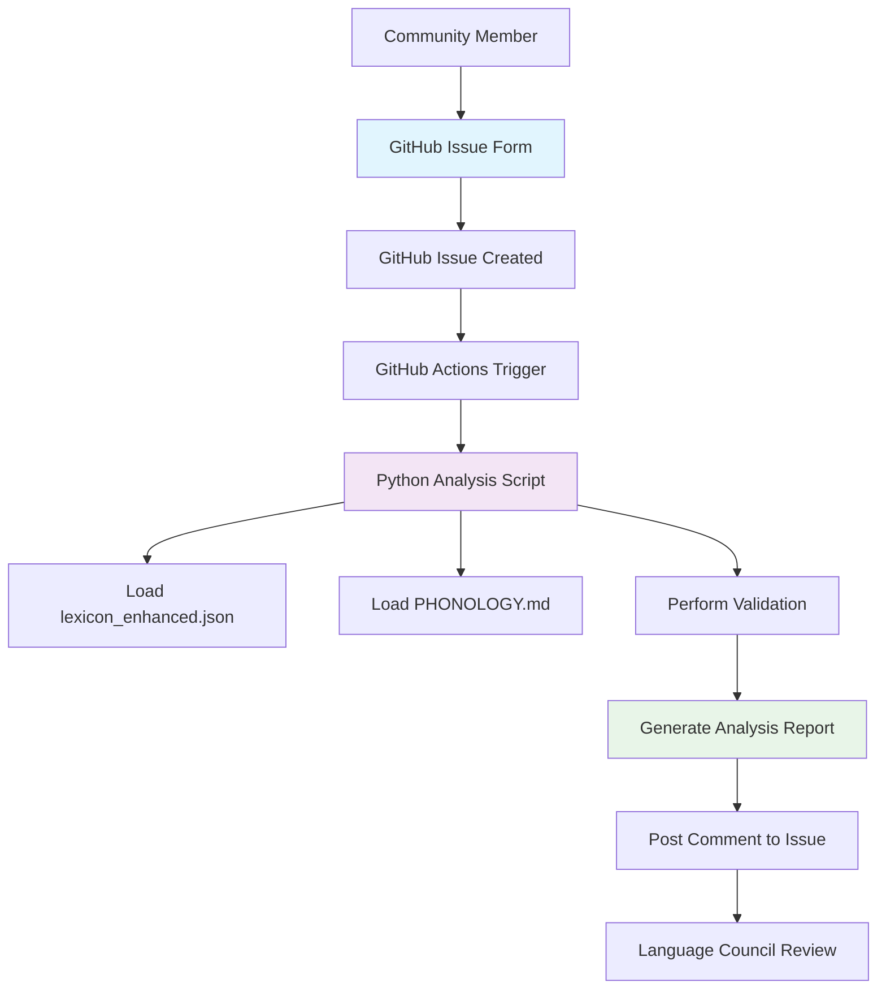

# Design Document

## Overview

The GitHub-native lexicon management system will transform the Fidakune word proposal process from an external website-based approach to a fully integrated GitHub workflow. This system leverages GitHub's native Issue Forms for structured data collection, GitHub Actions for automated analysis, and Python scripts for linguistic validation, creating a seamless experience for both contributors and Language Council reviewers.

The design follows a three-component architecture: a user-facing GitHub Issue Form, an automated GitHub Actions workflow, and a Python analysis engine that builds upon the existing `demo_lexicon_system.py` foundation.

## Architecture

### System Components



### Data Flow

1. **Input Phase**: User submits proposal via GitHub Issue Form
2. **Trigger Phase**: GitHub Actions detects new proposal issue
3. **Analysis Phase**: Python script validates proposal against existing lexicon and phonological rules
4. **Output Phase**: Automated analysis results posted as issue comment
5. **Review Phase**: Language Council uses analysis for informed decision-making

## Components and Interfaces

### Component 1: GitHub Issue Form

**File**: `.github/ISSUE_TEMPLATE/word_proposal.yml`

**Purpose**: Provides structured data collection interface for word proposals

**Interface Specification**:
- **Input Fields**:
  - `word`: Text input for proposed Fidakune word (required)
  - `definition`: Textarea for English definition (required)
  - `domain`: Dropdown for semantic domain selection (required)
  - `justification`: Textarea for etymology and justification (required)

- **Validation Rules**:
  - All fields marked as required must be completed
  - Form uses GitHub's native validation system
  - Automatic labeling with `["new-proposal", "lexicon"]`

- **Output Format**: Creates GitHub issue with structured markdown body containing form data

### Component 2: GitHub Actions Workflow

**File**: `.github/workflows/lexicon_bot.yml`

**Purpose**: Orchestrates automated analysis of new proposals

**Interface Specification**:
- **Trigger**: Issue events (opened, edited) with `new-proposal` label
- **Environment**: Ubuntu latest with Python 3.10
- **Dependencies**: 
  - Repository checkout
  - Python environment setup
  - Access to lexicon and phonology files

- **Input**: GitHub issue body (markdown formatted)
- **Output**: Analysis report posted as issue comment

### Component 3: Analysis Script

**File**: `scripts/analyze_proposal.py`

**Purpose**: Core linguistic validation engine

**Interface Specification**:
- **Input**: Command-line argument containing issue body text
- **Processing**:
  - Parse markdown-formatted issue body
  - Extract structured data from form fields
  - Load `lexicon_enhanced.json` for existing word database
  - Load `PHONOLOGY.md` for phonological rules
  - Perform validation checks
- **Output**: Formatted markdown analysis report

## Data Models

### Issue Body Structure

The GitHub Issue Form generates markdown in this format:

```markdown
### Proposed Word
kore-pet

### Definition
Grief; a feeling of deep sorrow.

### Semantic Domain
Emotion

### Justification & Etymology
This compound word combines 'kore' (heart) with 'pet' (stone), representing the heavy, stone-like feeling in one's heart during grief.
```

### Analysis Report Structure

```markdown
🤖 **Fidakune-Bot Analysis:**

## Phonotactic Analysis
✅ **PASS** - All phonemes are valid Fidakune sounds
✅ **PASS** - Syllable structure follows CV pattern
✅ **PASS** - Hyphen placement is correct for compound words

## Lexicon Analysis
✅ **PASS** - Root word 'kore' exists in lexicon (heart)
✅ **PASS** - Root word 'pet' exists in lexicon (stone)
⚠️ **WARNING** - Similar pronunciation to existing word 'kore-pek' (heartbreak)

## Semantic Analysis
✅ **PASS** - Compound meaning logically derives from roots
✅ **PASS** - Domain 'Emotion' is appropriate for this definition

## Recommendation
✅ **APPROVE** - This proposal meets all technical requirements with minor pronunciation similarity warning.
```

### Lexicon Data Model

The system uses the existing `lexicon_enhanced.json` structure:

```json
{
  "word": "kore",
  "pronunciation": "/ˈko.re/",
  "definition": "heart",
  "domain": "Body and Health",
  "pos_type": "noun",
  "word_type": "Root",
  "roots": null,
  "derived_words": ["kore-pet", "kore-lum"],
  "etymology_note": null
}
```

## Error Handling

### GitHub Actions Error Handling

- **Script Failure**: If analysis script fails, workflow continues and posts error message
- **File Access Issues**: Graceful handling of missing lexicon or phonology files
- **Permission Issues**: Proper error logging without exposing sensitive information

### Analysis Script Error Handling

- **Malformed Input**: Robust parsing with fallback for unexpected issue body formats
- **Missing Data Files**: Clear error messages when lexicon or phonology files unavailable
- **Invalid Phonemes**: Detailed reporting of which specific phonemes are problematic
- **Parsing Errors**: Graceful degradation when form fields cannot be extracted

### User Experience Error Handling

- **Form Validation**: GitHub's native validation prevents submission of incomplete forms
- **Clear Feedback**: Analysis results use clear pass/warning/fail indicators
- **Actionable Messages**: Error messages provide specific guidance for resolution

## Testing Strategy

### Unit Testing

**Analysis Script Tests**:
- Test phonotactic validation with valid/invalid phoneme combinations
- Test compound word root verification
- Test homophone detection algorithms
- Test markdown parsing and output formatting

**Test Data**:
- Valid proposals that should pass all checks
- Invalid phoneme combinations (e.g., using 'z' or 'x')
- Invalid syllable structures (e.g., consonant clusters in wrong positions)
- Compound words with missing roots
- Homophone conflicts

### Integration Testing

**GitHub Actions Workflow Tests**:
- Test workflow trigger on issue creation
- Test environment setup and dependency installation
- Test script execution with various input formats
- Test comment posting functionality

**End-to-End Testing**:
- Create test issues with various proposal types
- Verify complete workflow from form submission to analysis comment
- Test edge cases like malformed issue bodies
- Verify proper labeling and issue management

### Manual Testing

**Form Usability**:
- Test form completion with various browsers
- Verify field validation works correctly
- Test dropdown options match semantic domains from lexicon
- Ensure form instructions are clear and helpful

**Analysis Accuracy**:
- Submit known valid proposals and verify correct approval
- Submit proposals with known issues and verify proper warnings
- Test compound word analysis with existing root combinations
- Verify pronunciation similarity detection accuracy

### Performance Testing

**Script Performance**:
- Measure analysis time for typical proposals (target: <30 seconds)
- Test with large lexicon sizes (up to 1,200 words)
- Verify memory usage remains reasonable

**GitHub Actions Performance**:
- Monitor workflow execution time
- Test concurrent proposal handling
- Verify rate limiting compliance

## Security Considerations

### Input Validation

- **Sanitization**: All user input properly escaped in markdown output
- **Length Limits**: Reasonable limits on field lengths to prevent abuse
- **Content Filtering**: Basic checks for inappropriate content in proposals

### Access Control

- **Repository Permissions**: Only authorized users can modify workflow files
- **Action Permissions**: Workflow has minimal required permissions
- **Secret Management**: No sensitive data stored in workflow or scripts

### Data Privacy

- **Public Repository**: All proposals are public by design
- **No Personal Data**: Form collects only linguistic information
- **Audit Trail**: All actions logged through GitHub's native systems

## Implementation Phases

### Phase 1: Core Infrastructure
1. Create GitHub Issue Form with basic field structure
2. Implement minimal GitHub Actions workflow
3. Create basic analysis script with phonotactic validation

### Phase 2: Enhanced Analysis
1. Add homophone detection capabilities
2. Implement compound word root verification
3. Add semantic domain validation

### Phase 3: User Experience
1. Refine analysis report formatting
2. Add detailed error messages and suggestions
3. Implement comprehensive testing suite

### Phase 4: Optimization
1. Performance optimization for large lexicons
2. Enhanced error handling and edge cases
3. Documentation and maintenance procedures