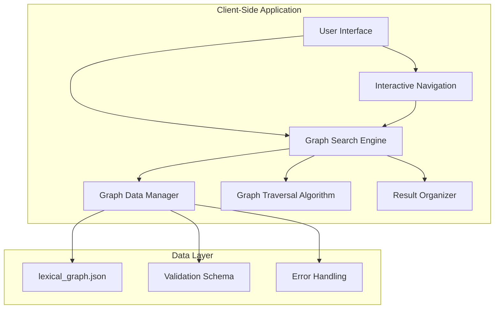
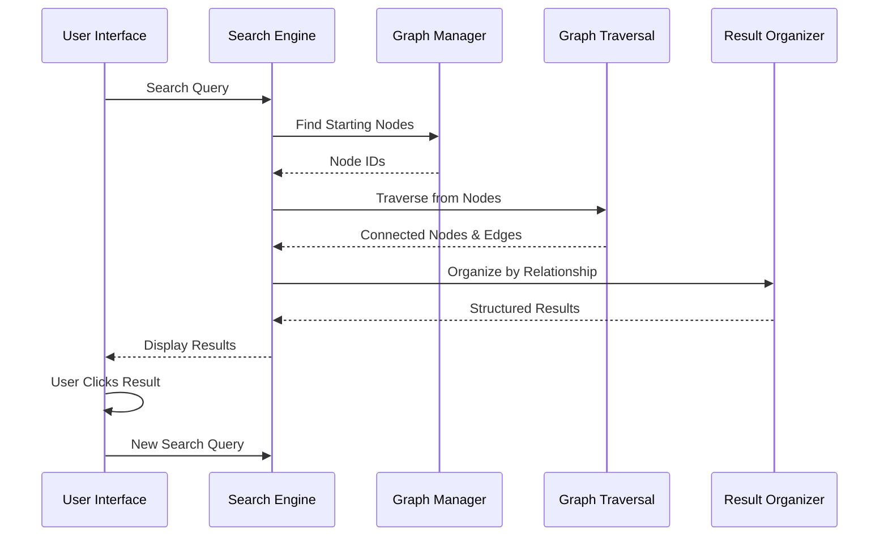

# Design Document

## Overview

The Graph-Based Conceptual Search system implements a sophisticated semantic exploration tool for the Fidakune lexicon. The system transforms the traditional linear search paradigm into an interactive network exploration experience, allowing users to discover conceptual relationships, root connections, and semantic associations through graph traversal.

The architecture follows the three-component design: a curated data model (lexical_graph.json), an intelligent search engine with graph algorithms, and an interactive user interface that visualizes relationships. This design enables users to understand how Fidakune's compound words and root systems create networks of meaning, supporting the language's principle of expressive capacity through systematic word relationships.

## Architecture

### System Architecture



### Data Flow Architecture



## Components and Interfaces

### 1. Data Model Component

**Purpose:** Defines the structure and management of the lexical graph data.

#### lexical_graph.json Structure
```json
{
  "metadata": {
    "version": "1.0",
    "created": "2024-12-19",
    "curated_by": "Fidakune Language Council",
    "node_count": 150,
    "edge_count": 300
  },
  "nodes": [
    {
      "id": "fidakune_pet",
      "label": "pet",
      "type": "fidakune_root",
      "definition": "stone",
      "domain": "Nature",
      "pronunciation": "/pet/"
    },
    {
      "id": "fidakune_kore_pet",
      "label": "kore-pet",
      "type": "fidakune_word",
      "definition": "grief",
      "domain": "Emotion",
      "pronunciation": "/ˈko.ɾe.pet/"
    },
    {
      "id": "en_stone",
      "label": "stone",
      "type": "english_keyword",
      "definition": "hard mineral matter",
      "domain": "Nature"
    }
  ],
  "edges": [
    {
      "source": "fidakune_kore_pet",
      "target": "fidakune_pet",
      "relationship": "has_root",
      "strength": 1.0,
      "description": "kore-pet contains the root pet"
    },
    {
      "source": "fidakune_pet",
      "target": "en_stone",
      "relationship": "is_a",
      "strength": 0.9,
      "description": "pet means stone"
    },
    {
      "source": "fidakune_kore_pet",
      "target": "en_grief",
      "relationship": "is_related_to",
      "strength": 0.8,
      "description": "conceptual similarity"
    }
  ]
}
```

#### Node Types
- **fidakune_root:** Base morphological units (pet, kore, lum)
- **fidakune_word:** Complete vocabulary items (kore-pet, sole-lum)
- **english_keyword:** English concepts for cross-linguistic connections

#### Relationship Types
- **is_a:** Direct semantic equivalence (pet → stone)
- **has_root:** Morphological composition (kore-pet → kore, pet)
- **is_related_to:** Conceptual associations (grief → sadness)

### 2. Graph Search Engine Component

**Purpose:** Implements efficient graph algorithms for conceptual search and traversal.

#### Core Classes

```javascript
class GraphSearchEngine {
    constructor(graphData) {
        this.graph = new Map();
        this.reverseIndex = new Map();
        this.loadGraph(graphData);
    }
    
    // Primary search method
    search(query, maxDepth = 2) {
        const startingNodes = this.findStartingNodes(query);
        const results = this.traverseGraph(startingNodes, maxDepth);
        return this.organizeResults(results);
    }
    
    // Graph traversal using BFS
    traverseGraph(startingNodes, maxDepth) {
        const visited = new Set();
        const results = [];
        const queue = startingNodes.map(node => ({ node, depth: 0, path: [node] }));
        
        while (queue.length > 0) {
            const { node, depth, path } = queue.shift();
            
            if (visited.has(node.id) || depth > maxDepth) continue;
            visited.add(node.id);
            
            // Collect connected nodes
            const connections = this.getConnections(node.id);
            connections.forEach(connection => {
                results.push({
                    source: node,
                    target: connection.target,
                    relationship: connection.relationship,
                    strength: connection.strength,
                    path: [...path, connection.target],
                    depth: depth + 1
                });
                
                if (depth + 1 <= maxDepth) {
                    queue.push({
                        node: connection.target,
                        depth: depth + 1,
                        path: [...path, connection.target]
                    });
                }
            });
        }
        
        return results;
    }
}

class GraphDataManager {
    constructor() {
        this.schema = new GraphSchema();
        this.validator = new GraphValidator();
    }
    
    async loadGraphData() {
        try {
            const response = await fetch('lexical_graph.json');
            const data = await response.json();
            
            this.validateGraphData(data);
            return this.processGraphData(data);
        } catch (error) {
            throw new GraphLoadError(`Failed to load graph data: ${error.message}`);
        }
    }
    
    validateGraphData(data) {
        const validation = this.validator.validate(data, this.schema);
        if (!validation.valid) {
            throw new GraphValidationError(validation.errors);
        }
    }
}
```

#### Search Algorithm Implementation

**Step 1: Find Starting Nodes**
```javascript
findStartingNodes(query) {
    const normalizedQuery = query.toLowerCase().trim();
    const matches = [];
    
    // Exact label matches (highest priority)
    this.graph.forEach(node => {
        if (node.label.toLowerCase() === normalizedQuery) {
            matches.push({ node, score: 1.0, matchType: 'exact' });
        }
    });
    
    if (matches.length > 0) return matches;
    
    // Partial matches and synonyms
    this.graph.forEach(node => {
        if (node.label.toLowerCase().includes(normalizedQuery) ||
            node.definition.toLowerCase().includes(normalizedQuery)) {
            matches.push({ node, score: 0.7, matchType: 'partial' });
        }
    });
    
    return matches.sort((a, b) => b.score - a.score);
}
```

**Step 2: Breadth-First Traversal**
```javascript
traverseGraph(startingNodes, maxDepth) {
    const queue = new Queue();
    const visited = new Set();
    const results = new Map();
    
    // Initialize queue with starting nodes
    startingNodes.forEach(({ node }) => {
        queue.enqueue({ node, depth: 0, path: [node.id] });
    });
    
    while (!queue.isEmpty()) {
        const { node, depth, path } = queue.dequeue();
        
        if (visited.has(node.id) || depth > maxDepth) continue;
        visited.add(node.id);
        
        // Get all outgoing edges
        const edges = this.getOutgoingEdges(node.id);
        
        edges.forEach(edge => {
            const targetNode = this.getNode(edge.target);
            const resultKey = `${edge.source}-${edge.target}-${edge.relationship}`;
            
            results.set(resultKey, {
                source: node,
                target: targetNode,
                relationship: edge.relationship,
                strength: edge.strength,
                depth: depth + 1,
                path: [...path, edge.target]
            });
            
            // Add target to queue for further exploration
            if (depth + 1 < maxDepth) {
                queue.enqueue({
                    node: targetNode,
                    depth: depth + 1,
                    path: [...path, edge.target]
                });
            }
        });
    }
    
    return Array.from(results.values());
}
```

### 3. User Interface Component

**Purpose:** Provides interactive visualization of conceptual relationships.

#### Main Interface Structure

```html
<div class="graph-search-container">
    <div class="search-section">
        <input type="search" class="graph-search-input" 
               placeholder="Explore conceptual relationships..." />
        <div class="search-suggestions"></div>
    </div>
    
    <div class="navigation-breadcrumbs">
        <div class="breadcrumb-trail"></div>
    </div>
    
    <div class="results-container">
        <div class="relationship-category" data-relationship="is_a">
            <h3>Directly Related Concepts</h3>
            <div class="concept-list"></div>
        </div>
        
        <div class="relationship-category" data-relationship="has_root">
            <h3>Component Roots to Consider</h3>
            <div class="concept-list"></div>
        </div>
        
        <div class="relationship-category" data-relationship="is_related_to">
            <h3>Related Ideas</h3>
            <div class="concept-list"></div>
        </div>
    </div>
    
    <div class="concept-details-panel">
        <div class="concept-info"></div>
        <div class="relationship-paths"></div>
    </div>
</div>
```

#### Interactive Features

**Clickable Concept Navigation:**
```javascript
class ConceptNavigator {
    constructor(searchEngine) {
        this.searchEngine = searchEngine;
        this.history = [];
        this.currentConcept = null;
    }
    
    navigateToConcept(conceptId) {
        // Add current concept to history
        if (this.currentConcept) {
            this.history.push(this.currentConcept);
        }
        
        // Perform new search
        const concept = this.searchEngine.getNode(conceptId);
        const results = this.searchEngine.search(concept.label);
        
        // Update UI
        this.updateBreadcrumbs();
        this.displayResults(results);
        this.currentConcept = concept;
        
        // Announce navigation to screen readers
        this.announceNavigation(concept);
    }
    
    goBack() {
        if (this.history.length > 0) {
            const previousConcept = this.history.pop();
            this.navigateToConcept(previousConcept.id);
        }
    }
}
```

**Result Organization and Display:**
```javascript
class ResultsDisplayManager {
    displayResults(searchResults) {
        const categorized = this.categorizeResults(searchResults);
        
        // Clear previous results
        this.clearResults();
        
        // Display each category
        Object.entries(categorized).forEach(([relationship, results]) => {
            this.displayCategory(relationship, results);
        });
        
        // Update accessibility announcements
        this.announceResultsUpdate(searchResults);
    }
    
    displayCategory(relationship, results) {
        const container = document.querySelector(`[data-relationship="${relationship}"] .concept-list`);
        const categoryTitle = this.getCategoryTitle(relationship);
        
        if (results.length === 0) {
            container.innerHTML = '<p class="no-results">No connections found in this category.</p>';
            return;
        }
        
        const resultElements = results.map(result => this.createResultElement(result));
        container.innerHTML = resultElements.join('');
        
        // Add click handlers
        container.querySelectorAll('.concept-item').forEach(item => {
            item.addEventListener('click', (e) => {
                const conceptId = e.target.dataset.conceptId;
                this.navigator.navigateToConcept(conceptId);
            });
        });
    }
    
    createResultElement(result) {
        const strengthIndicator = this.createStrengthIndicator(result.strength);
        const pathInfo = this.createPathInfo(result.path);
        
        return `
            <div class="concept-item" 
                 data-concept-id="${result.target.id}"
                 tabindex="0"
                 role="button"
                 aria-label="Explore ${result.target.label}">
                <div class="concept-header">
                    <span class="concept-label">${result.target.label}</span>
                    <span class="concept-type">${result.target.type}</span>
                </div>
                <div class="concept-definition">${result.target.definition}</div>
                <div class="concept-meta">
                    ${strengthIndicator}
                    ${pathInfo}
                </div>
            </div>
        `;
    }
}
```

## Data Models

### Graph Node Model
```javascript
class GraphNode {
    constructor(data) {
        this.id = data.id;
        this.label = data.label;
        this.type = data.type; // fidakune_root, fidakune_word, english_keyword
        this.definition = data.definition;
        this.domain = data.domain;
        this.pronunciation = data.pronunciation;
        this.metadata = data.metadata || {};
    }
    
    isRoot() {
        return this.type === 'fidakune_root';
    }
    
    isWord() {
        return this.type === 'fidakune_word';
    }
    
    isEnglishKeyword() {
        return this.type === 'english_keyword';
    }
}
```

### Graph Edge Model
```javascript
class GraphEdge {
    constructor(data) {
        this.source = data.source;
        this.target = data.target;
        this.relationship = data.relationship; // is_a, has_root, is_related_to
        this.strength = data.strength || 1.0;
        this.description = data.description;
        this.metadata = data.metadata || {};
    }
    
    isDirectRelation() {
        return this.relationship === 'is_a';
    }
    
    isRootRelation() {
        return this.relationship === 'has_root';
    }
    
    isConceptualRelation() {
        return this.relationship === 'is_related_to';
    }
}
```

## Error Handling

### Graph Data Validation
```javascript
class GraphValidator {
    validate(graphData) {
        const errors = [];
        
        // Validate structure
        if (!graphData.nodes || !Array.isArray(graphData.nodes)) {
            errors.push('Missing or invalid nodes array');
        }
        
        if (!graphData.edges || !Array.isArray(graphData.edges)) {
            errors.push('Missing or invalid edges array');
        }
        
        // Validate nodes
        graphData.nodes.forEach((node, index) => {
            if (!node.id || !node.label || !node.type) {
                errors.push(`Node ${index}: Missing required fields`);
            }
            
            if (!['fidakune_root', 'fidakune_word', 'english_keyword'].includes(node.type)) {
                errors.push(`Node ${index}: Invalid type "${node.type}"`);
            }
        });
        
        // Validate edges
        const nodeIds = new Set(graphData.nodes.map(n => n.id));
        graphData.edges.forEach((edge, index) => {
            if (!edge.source || !edge.target || !edge.relationship) {
                errors.push(`Edge ${index}: Missing required fields`);
            }
            
            if (!nodeIds.has(edge.source)) {
                errors.push(`Edge ${index}: Source node "${edge.source}" not found`);
            }
            
            if (!nodeIds.has(edge.target)) {
                errors.push(`Edge ${index}: Target node "${edge.target}" not found`);
            }
            
            if (!['is_a', 'has_root', 'is_related_to'].includes(edge.relationship)) {
                errors.push(`Edge ${index}: Invalid relationship "${edge.relationship}"`);
            }
        });
        
        return {
            valid: errors.length === 0,
            errors: errors
        };
    }
}
```

### Error Recovery Strategies
- **Data Loading Failures:** Graceful fallback to cached data or minimal graph
- **Invalid Relationships:** Skip invalid edges while preserving valid connections
- **Search Failures:** Provide alternative suggestions and error explanations
- **Performance Issues:** Implement depth limiting and result pagination

## Testing Strategy

### Unit Testing
- **Graph Loading:** Test JSON parsing and validation
- **Search Algorithm:** Verify BFS traversal accuracy
- **Result Organization:** Validate relationship categorization
- **Node/Edge Models:** Test data integrity and methods

### Integration Testing
- **End-to-End Search:** Complete search workflow validation
- **UI Interaction:** Click navigation and state management
- **Data Consistency:** Graph integrity across operations
- **Performance:** Response time and memory usage

### Accessibility Testing
- **Screen Reader:** NVDA, JAWS, VoiceOver compatibility
- **Keyboard Navigation:** Tab order and interaction
- **ARIA Compliance:** Live regions and semantic markup
- **Visual Accessibility:** High contrast and focus indicators

This design provides a robust foundation for implementing the graph-based conceptual search while maintaining the flexibility to optimize algorithms and enhance the user experience based on real-world usage patterns.