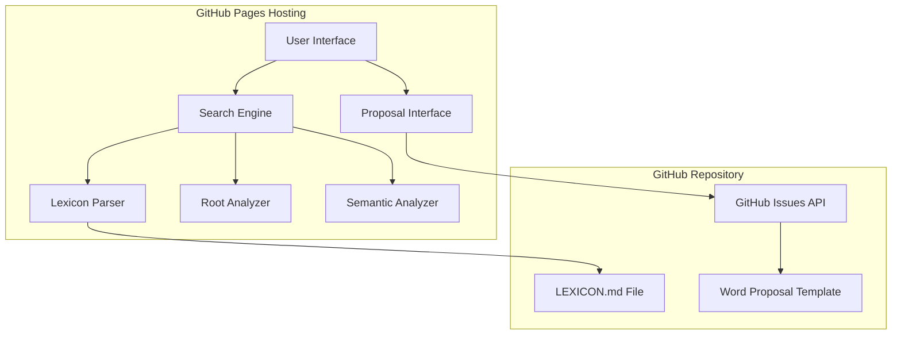

# Design Document

## Overview

The Lexicon Search Workflow system will be implemented as a single-page web application (SPA) hosted on GitHub Pages that provides an intuitive interface for community members to search the existing Fidakune lexicon and submit well-informed word proposals. The system integrates directly with the project's existing infrastructure, using LEXICON.md as the single source of truth and leveraging the existing GitHub issue template system for proposals.

The application will parse lexicon data in real-time from the repository, perform intelligent search operations including exact matching, root analysis, and semantic analysis, and seamlessly guide users through the proposal submission process. This design ensures that all proposals submitted to the Fidakune Language Council include evidence of comprehensive lexicon research, fulfilling a key requirement of the governance model outlined in REQUIREMENTS.md Section 4.4.

## Architecture

### System Architecture



### Data Flow

1. **Initialization**: Application loads and parses LEXICON.md from the repository
2. **Search Request**: User enters search query in the interface
3. **Search Processing**: Search engine performs exact match, root analysis, and semantic analysis
4. **Results Display**: Formatted results are presented to the user with clear categorization
5. **Proposal Initiation**: User clicks "Propose a New Word" button
6. **GitHub Integration**: System opens pre-populated GitHub issue using existing template
7. **Submission**: User completes and submits the proposal through GitHub's interface

## Components and Interfaces

### 1. User Interface Component

**Purpose**: Provides the primary interaction layer for users to search and initiate proposals.

**Key Elements**:
- **Search Bar**: Primary input field with placeholder text "Search for a word or concept..."
- **Search Results Panel**: Dynamic display area for search results
- **Proposal Button**: Prominent "Propose a New Word" call-to-action
- **Help Text**: Contextual guidance for users

**Responsive Design**: Mobile-first approach ensuring usability across devices

**Accessibility Features**:
- ARIA labels for all interactive elements
- Keyboard navigation support
- Screen reader announcements for dynamic content
- High contrast color scheme
- Focus indicators

### 2. Lexicon Parser Component

**Purpose**: Extracts and structures vocabulary data from LEXICON.md for search operations.

**Parsing Strategy**:
- **Markdown Processing**: Parse LEXICON.md structure to identify vocabulary entries
- **Data Extraction**: Extract Fidakune words, English definitions, domains, and compound information
- **Fallback Support**: Handle both current placeholder structure and future complete lexicon
- **JSON Integration**: Supplement with lexicon.json data when available

**Data Structure**:
```javascript
{
  word: "kore-pet",
  definition: "grief",
  domain: "Emotion",
  roots: ["kore", "pet"],
  pronunciation: "/ˈko.ɾe.pet/",
  type: "compound"
}
```

### 3. Search Engine Component

**Purpose**: Implements the three-tier search logic specified in requirements.

**Search Algorithms**:

**Tier 1 - Exact Match**:
- Direct string matching against Fidakune words
- Case-insensitive English definition matching
- Returns complete lexicon entry with full details

**Tier 2 - Root Analysis**:
- Tokenizes user query to identify potential Fidakune roots
- Searches existing vocabulary for words containing identified roots
- Handles compound word analysis (e.g., "water-rock" → aqua + pet)
- Returns related words with root highlighting

**Tier 3 - Semantic Analysis**:
- Keyword extraction from user query
- Fuzzy matching against English definitions
- Domain-based categorization
- Returns semantically related terms

**Search Result Formatting**:
```javascript
{
  exactMatches: [...],
  relatedWords: [...],
  semanticMatches: [...],
  searchPerformed: {
    query: "user input",
    timestamp: "ISO date",
    resultsFound: boolean
  }
}
```

### 4. Proposal Interface Component

**Purpose**: Seamlessly integrates with GitHub's issue system for word proposals.

**Integration Method**:
- **URL Construction**: Builds GitHub issue creation URL with pre-populated template
- **Template Population**: Uses existing `.github/ISSUE_TEMPLATE/word_proposal.yml`
- **Search Context**: Includes search history and results in issue body
- **Validation**: Ensures mandatory checkbox is included

**Pre-population Data**:
- Search query and results summary
- Related words found during search
- Timestamp of search performed
- Confirmation of lexicon search completion

## Data Models

### Lexicon Entry Model

```javascript
class LexiconEntry {
  constructor(word, definition, domain, pronunciation, type, roots = []) {
    this.word = word;
    this.definition = definition;
    this.domain = domain;
    this.pronunciation = pronunciation;
    this.type = type; // 'simple', 'compound', 'proper'
    this.roots = roots;
    this.examples = [];
  }
  
  isCompound() {
    return this.type === 'compound' && this.roots.length > 0;
  }
  
  matchesQuery(query) {
    return this.word.toLowerCase().includes(query.toLowerCase()) ||
           this.definition.toLowerCase().includes(query.toLowerCase());
  }
}
```

### Search Result Model

```javascript
class SearchResult {
  constructor(query) {
    this.query = query;
    this.timestamp = new Date().toISOString();
    this.exactMatches = [];
    this.relatedWords = [];
    this.semanticMatches = [];
    this.searchPerformed = true;
  }
  
  hasResults() {
    return this.exactMatches.length > 0 || 
           this.relatedWords.length > 0 || 
           this.semanticMatches.length > 0;
  }
  
  generateSummary() {
    // Creates formatted summary for GitHub issue inclusion
  }
}
```

## Error Handling

### Network Error Handling

**LEXICON.md Loading Failures**:
- **Retry Logic**: Automatic retry with exponential backoff
- **Fallback Data**: Use cached lexicon.json as backup data source
- **User Notification**: Clear error message with manual refresh option
- **Graceful Degradation**: Limited functionality with offline data

**GitHub API Failures**:
- **Alternative Flow**: Direct link to manual issue creation
- **Error Context**: Preserve search data for manual entry
- **User Guidance**: Step-by-step instructions for manual proposal

### Input Validation

**Search Query Validation**:
- **Sanitization**: Remove potentially harmful characters
- **Length Limits**: Reasonable query length restrictions
- **Character Filtering**: Focus on alphanumeric and basic punctuation
- **Empty Query Handling**: Helpful prompts for empty searches

**Proposal Data Validation**:
- **Required Fields**: Ensure all mandatory fields are populated
- **Format Checking**: Validate Fidakune phonotactics in proposed words
- **Duplicate Prevention**: Check against existing vocabulary before submission

### User Experience Error Handling

**No Results Found**:
- **Helpful Suggestions**: Alternative search terms or approaches
- **Clear Messaging**: Explain what "no results" means
- **Proposal Encouragement**: Emphasize that no results may indicate a genuine gap

**Ambiguous Results**:
- **Result Categorization**: Clear labeling of exact vs. related vs. semantic matches
- **Refinement Suggestions**: Help users narrow their search
- **Multiple Options**: Present all relevant possibilities

## Testing Strategy

### Unit Testing

**Component Testing**:
- **Lexicon Parser**: Test markdown parsing with various input formats
- **Search Engine**: Verify all three search tiers with known data sets
- **Root Analyzer**: Test compound word decomposition and root identification
- **Semantic Analyzer**: Validate keyword extraction and matching algorithms

**Data Validation Testing**:
- **Input Sanitization**: Test with malicious and edge-case inputs
- **Phonotactic Validation**: Verify Fidakune sound rule compliance
- **Homophone Detection**: Test against known vocabulary conflicts

### Integration Testing

**GitHub Integration**:
- **Issue Creation**: Test pre-populated template functionality
- **Authentication**: Verify user authentication flow
- **Template Population**: Ensure search context is properly included

**Data Source Integration**:
- **LEXICON.md Parsing**: Test with current and future lexicon formats
- **JSON Fallback**: Verify seamless fallback to lexicon.json
- **Real-time Updates**: Test behavior when lexicon is updated

### User Acceptance Testing

**Accessibility Testing**:
- **Screen Reader Compatibility**: Test with NVDA, JAWS, and VoiceOver
- **Keyboard Navigation**: Verify all functionality accessible via keyboard
- **Color Contrast**: Validate WCAG 2.1 compliance
- **Mobile Accessibility**: Test on various mobile devices and orientations

**Usability Testing**:
- **Search Workflow**: Test complete search-to-proposal workflow
- **Error Recovery**: Test user experience during error conditions
- **Performance**: Verify acceptable load times and responsiveness
- **Cross-browser Compatibility**: Test on major browsers and versions

### Performance Testing

**Load Testing**:
- **Large Lexicon Handling**: Test with projected 1,200-word vocabulary
- **Concurrent Users**: Simulate multiple simultaneous users
- **Search Performance**: Measure response times for complex queries
- **Memory Usage**: Monitor browser memory consumption

**Optimization Testing**:
- **Caching Strategy**: Verify effective caching of lexicon data
- **Bundle Size**: Ensure minimal JavaScript payload
- **Progressive Loading**: Test incremental feature loading
- **Offline Functionality**: Verify graceful degradation without network

This comprehensive testing strategy ensures the system meets all functional requirements while providing an excellent user experience across diverse usage scenarios and accessibility needs.