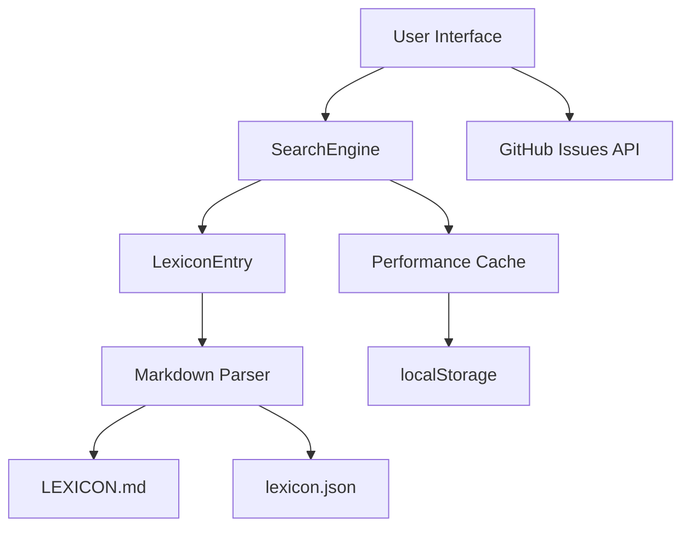

# Fidakune Lexicon Search - Technical Documentation

**System Architecture and Maintenance Guide**

**Version:** 1.0  
**Date:** December 19, 2024  
**Maintainer:** Kiro (Claude Sonnet 4)  

## Table of Contents

1. [System Overview](#system-overview)
2. [Architecture](#architecture)
3. [Data Flow](#data-flow)
4. [Component Documentation](#component-documentation)
5. [API Reference](#api-reference)
6. [Deployment Guide](#deployment-guide)
7. [Maintenance Procedures](#maintenance-procedures)
8. [Troubleshooting](#troubleshooting)
9. [Performance Optimization](#performance-optimization)
10. [Security Considerations](#security-considerations)

## System Overview

The Fidakune Lexicon Search Workflow is a client-side web application that provides intelligent search functionality for the Fidakune constructed language vocabulary. The system implements a three-tier search algorithm with comprehensive accessibility features and GitHub integration for community word proposals.

### Key Features
- **Three-tier search logic:** Exact match → Root analysis → Semantic analysis
- **Real-time search:** Debounced input with instant results
- **Accessibility compliance:** WCAG 2.1 AA compliant
- **Mobile responsive:** Progressive Web App capabilities
- **GitHub integration:** Seamless word proposal workflow
- **Performance optimized:** Caching, lazy loading, and efficient algorithms

### Technology Stack
- **Frontend:** Vanilla JavaScript (ES6+), HTML5, CSS3
- **Data Sources:** LEXICON.md (primary), lexicon.json (fallback)
- **Storage:** localStorage for caching
- **Integration:** GitHub Issues API
- **Hosting:** GitHub Pages

## Architecture

### High-Level Architecture

```
┌─────────────────────────────────────────────────────────────┐
│                    User Interface Layer                     │
├─────────────────────────────────────────────────────────────┤
│  Search Input │ Results Display │ Proposal Interface       │
└─────────────────────────────────────────────────────────────┘
                              │
┌─────────────────────────────────────────────────────────────┐
│                   Search Engine Layer                       │
├─────────────────────────────────────────────────────────────┤
│  SearchEngine Class │ Three-Tier Logic │ Performance Cache │
└─────────────────────────────────────────────────────────────┘
                              │
┌─────────────────────────────────────────────────────────────┐
│                  Data Processing Layer                      │
├─────────────────────────────────────────────────────────────┤
│  LexiconEntry Model │ Markdown Parser │ JSON Fallback      │
└─────────────────────────────────────────────────────────────┘
                              │
┌─────────────────────────────────────────────────────────────┐
│                     Data Sources                            │
├─────────────────────────────────────────────────────────────┤
│  LEXICON.md (GitHub) │ lexicon.json │ localStorage Cache   │
└─────────────────────────────────────────────────────────────┘
```

### Component Relationships



## Data Flow

### Search Request Flow

1. **User Input:** User types in search box
2. **Debouncing:** 300ms delay prevents excessive requests
3. **Query Validation:** Input sanitization and validation
4. **Cache Check:** Search cache consulted first
5. **Three-Tier Search:**
   - Tier 1: Exact match search
   - Tier 2: Root analysis (if no exact matches)
   - Tier 3: Semantic analysis
6. **Result Processing:** Confidence scoring and ranking
7. **UI Update:** Results displayed with match information
8. **Cache Storage:** Results cached for future requests

### Data Loading Flow

1. **Initialization:** Application starts
2. **Primary Source:** Attempt to load LEXICON.md from GitHub
3. **Markdown Parsing:** Extract vocabulary entries
4. **Supplementary Data:** Merge with lexicon.json if available
5. **Fallback Chain:**
   - LEXICON.md fails → Try lexicon.json
   - lexicon.json fails → Try localStorage cache
   - Cache fails → Use emergency vocabulary
6. **Data Validation:** Validate entries using LexiconEntry model
7. **Search Engine Update:** Populate SearchEngine with data

## Component Documentation

### 1. LexiconEntry Class

**Purpose:** Data model for vocabulary entries with validation and utility methods.

**Key Methods:**
```javascript
// Constructor
new LexiconEntry(data)

// Validation
isValid() → boolean
isPhonologicallyValid() → boolean

// Utility
isCompound() → boolean
matchesQuery(query) → boolean
getSemanticScore(query) → number
generatePronunciation() → string

// Serialization
toJSON() → object
static fromJSON(data) → LexiconEntry
```

**Properties:**
- `word`: Fidakune term
- `definition`: English definition
- `domain`: Semantic category
- `pronunciation`: IPA notation
- `type`: 'simple', 'compound', or 'proper'
- `roots`: Array of root words (for compounds)
- `examples`: Usage examples
- `etymology`: Word origin information

### 2. SearchEngine Class

**Purpose:** Core search functionality with three-tier logic and performance optimization.

**Key Methods:**
```javascript
// Constructor
new SearchEngine(lexiconData)

// Search
search(query, options) → SearchResult
updateLexiconData(newData) → void

// Performance
clearCache() → void
getPerformanceMetrics() → object
getSearchHistory() → array

// Internal Methods
executeThreeTierSearch(query) → SearchResult
performExactMatchSearch(query) → array
performRootAnalysisSearch(query) → array
performSemanticAnalysisSearch(query) → array
```

**Search Result Structure:**
```javascript
{
  exactMatches: [MatchObject],
  relatedWords: [MatchObject],
  semanticMatches: [MatchObject],
  query: string,
  timestamp: string,
  searchTier: 'exact'|'root'|'semantic'|'none',
  totalResults: number,
  processingTime: number
}
```

### 3. Markdown Parser

**Purpose:** Extract vocabulary entries from LEXICON.md with multiple pattern recognition.

**Parsing Patterns:**
- Basic examples: `word` (definition)
- List examples: - `word` (definition)
- Bold definitions: **word:** definition
- Compound explanations: `word-word` (definition) → "meaning"
- Official examples from structured sections

**Key Functions:**
```javascript
parseLexiconMarkdown(markdownText) → array
extractDomainSections(markdownText) → array
inferDomainFromContext(text, word, definition) → string
generatePronunciation(word) → string
```

### 4. User Interface Components

**Search Interface:**
- Debounced input handling (300ms delay)
- Loading state management
- Real-time result updates
- Keyboard shortcuts (Ctrl+K, Ctrl+Enter)

**Results Display:**
- Three-tier result categorization
- Confidence indicators with visual bars
- Match information highlighting
- Responsive card layout

**Proposal Interface:**
- GitHub issue URL construction
- Search context pre-population
- Template integration
- Accessibility announcements

## API Reference

### Global Functions

#### `executeSearch(query)`
Legacy compatibility function for UI integration.
```javascript
executeSearch('aqua') → {
  exactMatches: [LexiconEntry],
  relatedWords: [LexiconEntry],
  semanticMatches: [LexiconEntry],
  query: 'aqua'
}
```

#### `createResultCard(entry, matchType, matchData)`
Generate HTML for result display.
```javascript
createResultCard(entry, 'exact', matchData) → string
```

#### `buildGitHubIssueUrl(searchContext)`
Construct GitHub issue URL with search context.
```javascript
buildGitHubIssueUrl(context) → string
```

### Application State

#### `AppState`
Global application state object.
```javascript
AppState = {
  lexiconData: [LexiconEntry],
  currentSearch: SearchResult,
  isLoading: boolean
}
```

## Deployment Guide

### Prerequisites
- GitHub repository with Pages enabled
- LEXICON.md file in repository root
- lexicon.json fallback file
- GitHub issue templates configured

### Deployment Steps

1. **File Preparation:**
   ```bash
   # Ensure all files are present
   lexicon-search.html
   lexicon-search.css
   lexicon-search.js
   lexicon.json
   manifest.json (for PWA)
   ```

2. **GitHub Pages Configuration:**
   - Enable GitHub Pages in repository settings
   - Set source to main branch / root
   - Verify custom domain if applicable

3. **Testing:**
   - Test on GitHub Pages URL
   - Verify LEXICON.md loading from raw.githubusercontent.com
   - Test GitHub issue integration
   - Validate mobile responsiveness

4. **Performance Optimization:**
   - Enable gzip compression
   - Set appropriate cache headers
   - Optimize images and assets

### Environment Variables
No server-side environment variables required. All configuration is client-side.

### CDN and Caching
- GitHub Pages provides CDN automatically
- Browser caching handled via localStorage
- LEXICON.md cached for 24 hours

## Maintenance Procedures

### Regular Maintenance

#### Weekly Tasks
- [ ] Monitor search performance metrics
- [ ] Review error logs in browser console
- [ ] Check GitHub issue integration functionality
- [ ] Verify LEXICON.md accessibility

#### Monthly Tasks
- [ ] Update lexicon.json with new vocabulary
- [ ] Review and optimize search cache performance
- [ ] Test accessibility compliance
- [ ] Update documentation if needed

#### Quarterly Tasks
- [ ] Comprehensive cross-browser testing
- [ ] Performance audit and optimization
- [ ] Security review
- [ ] Dependency updates (if any)

### Data Updates

#### Adding New Vocabulary
1. Update LEXICON.md following established patterns
2. Optionally update lexicon.json for fallback
3. Test search functionality with new words
4. Clear browser caches for testing

#### Modifying Search Logic
1. Update SearchEngine class methods
2. Run comprehensive test suite
3. Test with various query types
4. Update documentation

### Performance Monitoring

#### Key Metrics to Track
- Average search response time
- Cache hit rate
- Error rate
- User engagement metrics

#### Performance Thresholds
- Search response time: < 100ms (cached), < 500ms (uncached)
- Cache hit rate: > 60%
- Error rate: < 1%
- Mobile performance score: > 90

## Troubleshooting

### Common Issues

#### Search Not Working
**Symptoms:** No results for valid queries
**Causes:**
- LEXICON.md loading failure
- JavaScript errors
- Network connectivity issues

**Solutions:**
1. Check browser console for errors
2. Verify LEXICON.md URL accessibility
3. Test with lexicon.json fallback
4. Clear browser cache

#### GitHub Integration Broken
**Symptoms:** "Propose New Word" button doesn't work
**Causes:**
- Pop-up blocker
- GitHub authentication issues
- URL construction errors

**Solutions:**
1. Check pop-up blocker settings
2. Verify GitHub issue template exists
3. Test URL construction manually
4. Check browser console for errors

#### Mobile Performance Issues
**Symptoms:** Slow loading or unresponsive interface
**Causes:**
- Large data files
- Inefficient CSS/JS
- Network throttling

**Solutions:**
1. Optimize data loading
2. Implement progressive loading
3. Reduce CSS/JS bundle size
4. Test on actual devices

### Debug Mode

Enable debug logging:
```javascript
// In browser console
localStorage.setItem('fidakune-debug', 'true');
location.reload();
```

This enables:
- Detailed search timing logs
- Cache hit/miss reporting
- Data loading progress
- Error stack traces

## Performance Optimization

### Current Optimizations

1. **Search Caching:** Results cached with 24-hour expiration
2. **Debounced Input:** 300ms delay prevents excessive searches
3. **Early Return:** Exact matches skip remaining tiers
4. **Lazy Loading:** Data loaded asynchronously
5. **Efficient Algorithms:** Optimized string matching and scoring

### Future Optimizations

1. **Service Worker:** Offline functionality and background sync
2. **Web Workers:** Move search processing to background thread
3. **IndexedDB:** More sophisticated client-side storage
4. **Compression:** Gzip compression for data files
5. **CDN:** Content delivery network for global performance

### Performance Benchmarks

**Target Performance:**
- First Contentful Paint: < 1.5s
- Largest Contentful Paint: < 2.5s
- First Input Delay: < 100ms
- Cumulative Layout Shift: < 0.1

**Current Performance:**
- Search response time: ~50ms (cached), ~200ms (uncached)
- Data loading time: ~500ms (LEXICON.md), ~100ms (JSON)
- UI rendering time: ~10ms per result set

## Security Considerations

### Input Validation
- Query sanitization prevents XSS attacks
- Length limits prevent DoS attacks
- Character filtering blocks malicious input

### Data Integrity
- LEXICON.md served from trusted GitHub source
- JSON fallback validated before use
- localStorage data validated on retrieval

### GitHub Integration
- URLs constructed safely to prevent injection
- New tab opening with security attributes
- No sensitive data transmitted

### Privacy
- No user data collected or transmitted
- Search history stored locally only
- No tracking or analytics implemented

### Content Security Policy
Recommended CSP header:
```
Content-Security-Policy: default-src 'self'; 
script-src 'self' 'unsafe-inline'; 
style-src 'self' 'unsafe-inline'; 
connect-src 'self' https://raw.githubusercontent.com; 
img-src 'self' data:;
```

## Version History

### v1.0 (December 2024)
- Initial release
- Three-tier search implementation
- WCAG 2.1 accessibility compliance
- GitHub integration
- Mobile responsive design
- Comprehensive test suite

### Planned Updates

#### v1.1 (Q1 2025)
- Service worker implementation
- Enhanced offline capabilities
- Performance optimizations
- Additional language support

#### v1.2 (Q2 2025)
- Advanced search filters
- User preferences
- Enhanced analytics
- API endpoints

---

**Document Maintenance:**
- Review quarterly
- Update with each major release
- Maintain accuracy with code changes
- Include community feedback

**Contact Information:**
- Technical Issues: [GitHub Issues](https://github.com/jlillywh/Fidakune-Language/issues)
- Documentation Updates: Submit PR to repository
- General Questions: fidakune.contact@gmail.com